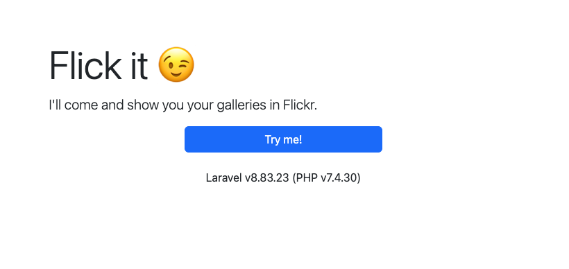

# Overview
A technical exam by [Peter Paul C. Cortez](mailto:innov.petercortez@gmail.com) for [compareclub](https://compareclub.com.au/) which shows a Flickr user's gallery and its photos.

# Setup
## System Requirements
| Software | Version      |
|----------|--------------|
| PHP      | ^7.3 or ^8.0 |

For starters, we're going to have to install our dependencies:
```shell
$ composer install
```

## Environment Variables
Now, the environment variables:
```shell
$ cp .env.example .env
```

Then, you're going to have to modify these variables:
* `FLICKR_APP_API_KEY`
* `FLICKR_APP_API_SECRET`

Get your own API key and secret from Flickr by creating an app [here](https://www.flickr.com/services/apps/create/apply/).

## Application Key
Laravel uses application keys to encrypt cookies, so this is basically required. You can generate one by running:
```shell
$ php artisan key:generate
```

## Database
When authenticating a user, we save its information in our database so that Laravel's authentication mechanism may remember their info. So let's
create the appropriate tables in our database by running:
```shell
$ php artisan migrate --seed
```

# Development
## Unit Tests
The API in this project has already been unit tested. Try them out by running:
```shell
$ vendor/bin/phpunit
```
